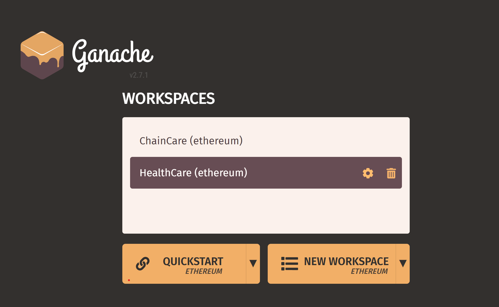
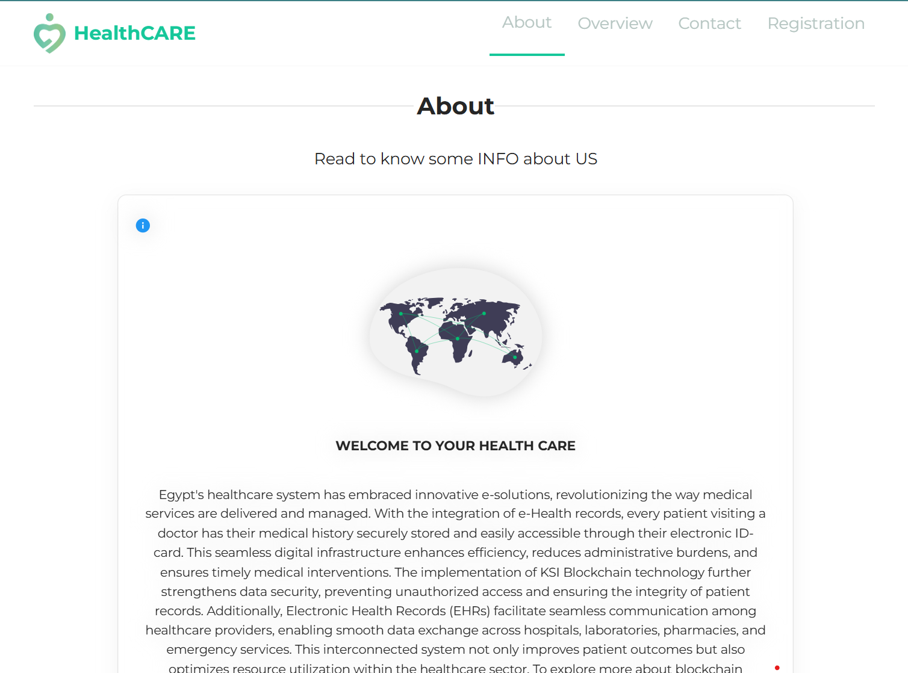
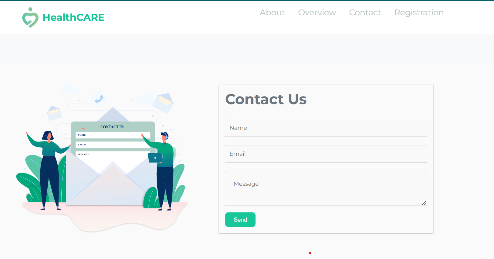
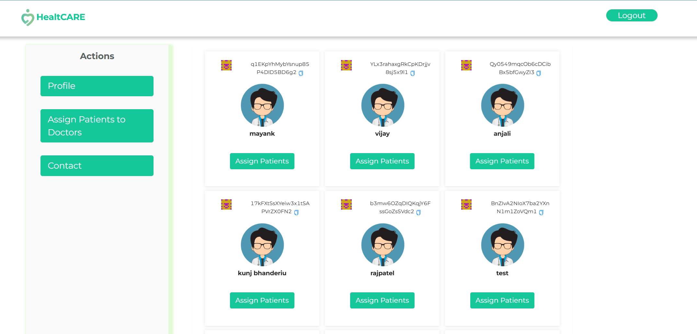
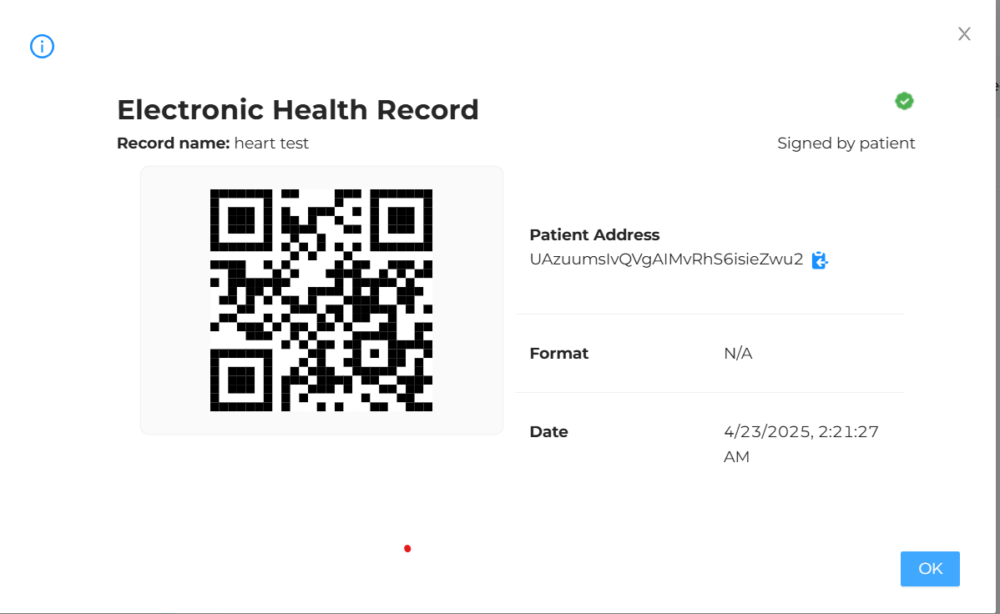

#  Decentralized Healthcare Application


##  Overview

This project is a **decentralized healthcare platform** built on blockchain technology, designed to securely manage patient records and healthcare-related transactions. By integrating **Ethereum smart contracts** with a modern **React.js frontend**, the system aims to provide a transparent, tamper-proof, and efficient digital healthcare solution.

> The application ensures that sensitive health information is encrypted and immutably stored, giving users full control over their data.

---

##  Key Features

-  **Smart Contracts** – Written in Solidity to manage patient records, provider access, and transactions without intermediaries.
-  **Blockchain Integration** – All data interactions are handled via the Ethereum blockchain, ensuring transparency and decentralization.
-  **Truffle Suite** – Used for smart contract development, automated testing, and blockchain deployment.
-  **Interactive Frontend** – Built with React.js to offer a responsive, intuitive interface for patients and providers.
-  **Local Development Blockchain** – Powered by Ganache for fast, local testing of contract interactions.

---

##  Tech Stack
Frontend: React.js, JavaScript, HTML/CSS

Backend: Node.js, Express.js

Blockchain: Ethereum, Solidity, Web3.js

Smart Contracts: Truffle, Ganache

Authentication: Firebase Authentication (for user login and signup)

Database: Firebase Firestore (for storing patient data and records)

Hosting: Firebase Hosting (for hosting the application)

Wallet: MetaMask (for Ethereum interaction)
---



##  Project Structure

```
healthcare/
├── contracts/        # Solidity smart contracts
├── migrations/       # Truffle deployment scripts
├── src/              # React.js frontend source
│   └── components/   # UI components
├── test/             # Smart contract test scripts
├── package.json      # Project metadata & dependencies
└── truffle-config.js # Truffle project configuration
```

---


---

##  Getting Started

###  Prerequisites

- Node.js and npm
- Truffle Suite (`npm install -g truffle`)
- Ganache CLI or Ganache GUI

###  Installation & Deployment

1. **Clone the repository**
   ```bash
   git clone https://github.com/kunj1610/healthcare.git
   cd healthcare
   ```

2. **Install dependencies**
   ```bash
   npm install
   ```

3. **Compile smart contracts**
   ```bash
   truffle compile
   ```

4. **Deploy contracts to local blockchain**
   ```bash
   truffle migrate
   ```

5. **Start frontend server**
   ```bash
   npm start
   ```

---

##  Testing

To run contract tests using Truffle:

```bash
truffle test
```

Tests are located in the `/test/` directory and cover contract logic, permissions, and access control.

---
##  Images of the Enhanced version of the Healthcare

 
 
 
 

##  Future Improvements

-  **IPFS Integration** for decentralized file storage (e.g., scan reports, X-rays)
-  **Mobile Responsiveness** using React Native
-  **Analytics Dashboard** for tracking health trends
-  **Zero-Knowledge Proofs** for privacy-preserving queries
-  **PDF Reports** generation for patient summaries

---

##  Contributing

Contributions, feedback, and suggestions are welcome! Feel free to fork the project and submit a pull request.

---

##  License

This project is licensed under the **MIT License** – see the [LICENSE](LICENSE) file for details.

---

##  Author

**Kunj Patel**  
GitHub: [kunj1610](https://github.com/kunj1610)  
Email: *[u2404035@uel.ac.uk]*  
Project maintained as part of academic coursework in decentralized systems.
